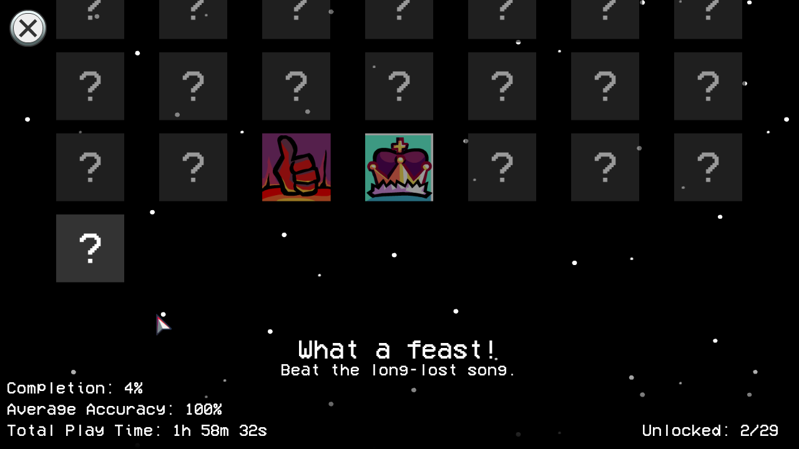

# Mod Awards Support
## Change Log
- Fixed an issue where scripts were loaded multiple times when duplicate plugins were present.
## Recommended Engine Version
1.1.2
## How to install
Just place the extracted folder into `./content/`.
## Features
Normally, placing `content/YourModName/data/awards.json` would cause all vanilla Awards to disappear, leaving only the Mod's Awards in the Awards Menu. This fixes that.

That's it.

**Really, that's it.**

