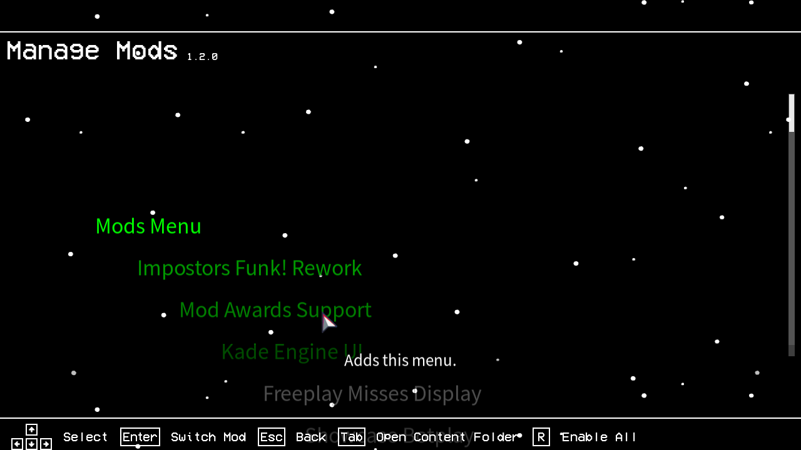

## Mods Menu 1.2.1 for VS IMPOSTOR LEGACY!! :33
## Change Log
- Only changed how the plugin handles things, so there’s no difference from 1.2.3😂
## Recommended Engine Version
1.1.2
## How to install
Just place the extracted folder into `./content/`.
### Features
The days of being unable to toggle Mod activation are over!

With this Mods Menu, you can freely change Mod activation and the order of your Mods!

**I didn't include this in the guide below, but you can change the order of Mods by control key.**

I'm still not very familiar with coding for this engine, so there may be some bugs.

ちなみに日本語対応してます。

**My English was translated using a translation tool :3**
